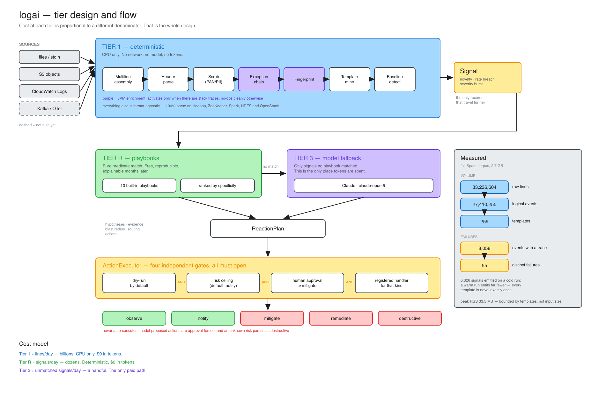

# logai — tiered log intelligence

Deterministic log analysis: multiline event assembly, PCI scrubbing, template
mining, exception fingerprinting, baseline breach detection, and gated reaction
plans. No model calls, no network, no tokens on the hot path.

**Format-agnostic, JVM-strongest.** Scrubbing, template mining and baselining
work on any timestamped log — validated at 100% parse on Hadoop, ZooKeeper,
Spark, HDFS and OpenStack (Python). The JVM layer on top — stack-trace
reassembly, `Caused by:` chains, throw-site fingerprinting — activates when
there are traces to parse and no-ops cleanly when there are not.

It is the bottom layer of a three-tier design. The point of the layer is to make
the expensive tiers affordable by changing what their cost is proportional to.

| Tier | Cost scales with | Does | Status |
| --- | --- | --- | --- |
| **1. Deterministic** | lines/day — billions | Assemble → scrub → template → fingerprint → baseline. CPU only. | built |
| **R. Reaction** | signals/day — dozens | Playbook match → ranked hypotheses, evidence, gated actions. Free when a playbook matches. | built |
| **3. Model fallback** | *unmatched* signals/day — a handful | Claude plans the long tail no playbook covers. | built (opt-in) |
| 2. Cheap model | *new templates*/day — thousands | Embed novel templates for dedup/clustering. | not built |

On the bundled fixture, 1,837 raw lines reduce to **5 templates** and **7
signals** — a 99.6% reduction in what any model would need to read.

## Architecture



The editable source is [`docs/architecture.excalidraw`](docs/architecture.excalidraw)
— open it at [excalidraw.com](https://excalidraw.com) via File → Open. It is
generated by `python docs/make_architecture.py`, so regenerate rather than
hand-editing if the design moves; `python docs/preview.py docs/architecture.svg`
refreshes the flat preview above.

## Quick start

```bash
python -m venv .venv && source .venv/bin/activate
pip install -e ".[dev]"     # note: `pip install logai` from PyPI is a
                            # different, unrelated project (Salesforce's)

python fixtures/generate.py
logai analyze fixtures/payment-service.log --app-package com.lily.

# with reaction plans
logai analyze fixtures/payment-service.log --app-package com.lily. --react

# against real production JVM logs (Hadoop, ZooKeeper, Spark, HDFS)
logai loghub list
logai analyze --loghub hadoop
```

```
Tier-1 report  fixtures/payment-service.log
========================================================================
  Input        1,837 raw lines -> 1,810 logical events (100.0% parsed)
  Templates    5  (367 raw lines per template)
  Failures     1 distinct fingerprint(s) across 3 events with a stack trace
  Redaction    1 events redacted  [cvv=1 email=1 pan=1]
  Signals      7 escalated to tier 2/3

Distinct failures
  faf083413eb888fc  x3  NullPointerException -> SQLTransientConnectionException
      SQLTransientConnectionException at com.lily.payments.PaymentService.authorize
      3 distinct call paths merged into this one failure
```

Use as a library:

```python
from logai import Tier1Pipeline, PipelineConfig

pipeline = Tier1Pipeline(PipelineConfig(app_packages=("com.lily.",)))
for event, signals in pipeline.stream(open("app.log")):
    for signal in signals:
        handoff_to_tier3(signal)      # only these cost money
```

`stream()` holds one event at a time; memory is bounded by the longest stack
trace, not by input size.

## The reaction tier

A signal says something changed. A plan says what to do about it. `--react`
turns every signal into a :class:`ReactionPlan`: ranked hypotheses, the evidence
they rest on, a blast-radius note, routing, and a list of actions each carrying
a risk level.

```
Issuer decline rate spike
  signal      rate_breach  lily-payments/template:2
  source      playbook (issuer-decline-spike)   confidence 70%
  routing     payments-ops -> #payments-incidents  PAGE  [P1]
  blast       Revenue-affecting: valid transactions are being declined.
  evidence
    - rate 200 in 60s vs baseline 5.0 (40.0x, z=39.0)
    - Template: Payment declined by issuer code=<NUM> attempt=<NUM>
    - Example trace id: d3953524639fd7d539a7e35839bf1c4b
  hypotheses (ranked)
    1. A specific issuer or BIN range is degraded and declining valid authorisations.
    2. A rules or risk-model change is rejecting traffic it previously approved.
    3. An upstream tokenisation or 3DS step is failing, producing downstream declines.
    4. Genuine fraud pressure: the rise is correct and should not be suppressed.
  actions
    [auto]     observe     Break declines down by issuer, BIN, response code and region
    [auto]     notify      Notify payments operations with the decline breakdown
    [approval] remediate   Revert the correlated risk rule change
        rollback: Re-apply the rule once validated
```

**Playbooks first, model second.** Nine built-in playbooks cover the common JVM
and payments failure modes (pool exhaustion, OOM, downstream timeout, circuit
breaker, decline spike, NPE regression, error burst, plus two catch-alls). They
are pure predicate evaluation — free, reproducible, and explainable months
later. `--llm` adds a Claude planner for signals no playbook matches, which is
where cost is actually incurred: it scales with *unmatched* signals, not events.

Playbooks are ranked by specificity, so a rule naming an exception class beats a
catch-all on the same signal kind. Routing escalates to a page on its own when a
deviation exceeds 10x baseline, whatever the playbook said.

### Execution is gated three ways

`--execute` is required before anything runs at all, and even then:

1. **dry-run is the default.** Results record what *would* have happened.
2. **A risk ceiling** (`--max-risk`, default `notify`) blocks anything above it
   regardless of approval. Levels: observe, notify, mitigate, remediate,
   destructive.
3. **Approval.** Actions at `mitigate` and above need a human; the default
   approver denies everything.

On top of that, execution dispatches only to handlers you register by action
kind. There is no default handler and no shell evaluation — a playbook file
cannot cause execution of anything you have not explicitly wired up. An action's
`command` field is documentation for a human, not something the executor runs.

**Model-generated actions can never auto-execute.** Every action returned by the
planner has approval forced on regardless of the risk it claimed, and an
unrecognised risk level is treated as `destructive` rather than `observe` — it
fails closed. A model may propose a rollback; only a person may authorise one.

```python
from logai import ReactionEngine, ActionExecutor, ExecutorConfig, RiskLevel

executor = ActionExecutor(
    ExecutorConfig(dry_run=False, max_risk=RiskLevel.NOTIFY),
    approver=lambda action, plan: ask_oncall(action),
    handlers={"notify": page_via_pagerduty},   # only wired kinds can run
)
for plan in ReactionEngine().plan_all(signals):
    executor.execute(plan)
```

## Data sources

```python
from logai.sources import loghub
from logai.sources.aws import S3LogSource, CloudWatchLogsSource

pipeline.run(loghub.load("hadoop"))
pipeline.run(S3LogSource(bucket="my-logs", prefix="payments/2024/01/15/"))
pipeline.run(CloudWatchLogsSource(log_group="/aws/ecs/payments", start=yesterday))
```

**loghub** (`pip install` nothing — stdlib download) provides real production
logs from four JVM systems, and they are a genuine test: three of the four
layouts broke the header patterns that were written against Spring Boot and
Logback defaults. All four now parse at 100%, including ZooKeeper's habit of
packing the logger inside the thread bracket
(`[QuorumPeer[myid=1]/...:FastLeaderElection@774]`).

The published **2k samples contain no stack traces** — they are single-line
only. The **full datasets on Zenodo** do. Hadoop is the one to reach for:

```bash
logai analyze --loghub-full hadoop --app-package org.apache.hadoop.
```

2.6 MB compressed; 394k lines of which 204k are stack-trace continuations,
across 6,426 `Caused by:` chains, from a cluster with injected faults (machine
down, network disconnect, disk full).

### What the full dataset showed

```
Input        394,310 raw lines -> 180,897 logical events (100.0% parsed)
Templates    259  (1,522 raw lines per template)
Failures     23 distinct fingerprint(s) across 6,233 events with a stack trace

783f728cd71bfb3b  x5303  NoRouteToHostException -> NoRouteToHostException
    NoRouteToHostException at org.apache.hadoop.net.NetUtils.wrapWithMessage
    5 distinct call paths merged into this one failure
```

- **Multiline assembly**: 394k physical lines became 181k logical events, all
  headers parsed. Generic single-line tooling would have seen 394k "events".
- **Fingerprinting**: 6,233 exceptions collapsed to **23 distinct failures**
  (271:1), and the merges are correct — 5,303 "No route to host" events arriving
  through 5 different call paths are one injected network fault, while the
  disk-full (`FSError -> IOException`) and connection-reset failures stay
  separate. Varying values in a message (`firstBadLink as 10.86.169.121` vs
  `...165.66`) merge; differing root-cause *classes* do not.
- **Throughput**: ~26k lines/sec single-threaded, no tuning.
- **It found a real bug in this code**: 58 false PAN redactions, fixed above.

**AWS** sources cover the two shapes Centralized Logging with OpenSearch
(formerly "Log Hub") leaves logs in — S3 objects and CloudWatch Logs streams.
Both yield plain lines, so multiline assembly still happens on our side, because
neither source preserves the notion of a logical event. Requires
`pip install "logai[aws]"`; boto3 is imported lazily.

### Scale: the full Spark dataset

```bash
logai analyze --loghub-full spark --app-package org.apache.spark.
```

2.7 GB, 3,852 files, **33.2M lines** — 84x Hadoop, and a different failure mix
(PySpark `PythonException`, `RpcTimeoutException`, YARN container failures).

```
Input        33,236,604 raw lines -> 27,410,255 logical events (100.0% parsed)
Templates    259  (128,327 raw lines per template)
Failures     55 distinct fingerprint(s) across 8,058 events with a stack trace
Peak RSS     33.5 MB
```

- **Memory stayed at 33.5 MB against a 2.7 GB corpus** — bounded by distinct
  templates and failures, not by input size, which is the design premise.
- **Scala frames parse**: name-mangled methods
  (`RpcTimeout.org$apache$spark$rpc$RpcTimeout$$createRpcTimeoutException`),
  anonymous functions (`$$anonfun$addMessageIfTimeout$1.applyOrElse`), `.scala`
  sources, `scala.*` as framework. Chains up to five deep
  (`SparkException → YarnException → Error → SparkException → YarnException`).
- **`top_n=1` is stable across recompiles.** Scala numbers anonymous functions
  at compile time, so those names shift between builds. Frame 0 is the throw
  site and is a real named method — no throw site in the sample was
  compiler-generated — so the fingerprint survives a renumbering that would
  change it at `top_n=5`. There is a test pinning this.
- ~10.5k lines/sec here against ~26k on Hadoop, sharing a core with another run.

**Two gaps it found**, both fixed:

1. **83 of 183 signals matched no playbook** — every one a rate breach. The only
   rate-breach playbook was the payments-specific decline spike, so any
   non-payments service hit "manual triage required" for its commonest signal
   kind. A generic rate-breach playbook now covers them at low confidence;
   coverage is 183/183 and the payments playbook still wins where it applies.
2. **7 PAN false positives survived the IIN fix** — 19-digit Spark RPC request
   ids such as `4661816796531593848`. 19 is a legitimate Visa length, the id
   starts with 4, and it passes Luhn by chance. That is about one per five
   million lines, and it is *not* silently narrowed away: dropping 19-digit
   support would under-redact real cards. Instead `pan_lengths` lets a shop that
   only handles 16-digit cards remove the class:
   `Scrubber(pan_lengths={16})`, or `--pan-lengths 16`.

## Why this exists rather than a generic log-AI library

Generic log tooling assumes one line is one event. That assumption is false on
the JVM and it fails loudly: a 40-line stack trace becomes 40 "events", every
distinct frame combination mints its own template, and the real signal is buried
under template explosion. Everything below follows from fixing that.

### Design decisions worth knowing

**Multiline assembly is header-driven.** A new event begins at a line with a
leading timestamp; everything after it belongs to that event. This survives
arbitrary junk inside a trace — multi-line exception messages, `Caused by:`
chains, interleaved framework noise — where shape-matching heuristics do not.
The heuristic fallback is used only before the first header match.

**Fingerprints group by throw site, not by call path.** Frames run
innermost-first, so frame 0 is where the exception was raised and later frames
are the path that reached it. The same defect hit from a REST controller, a
Kafka consumer and a nightly job produces three different traces; hashing the
throwable chain plus frame 0 collapses them to one failure. Raise
`fingerprint_top_n` if you would rather group path-sensitively.

**Framework frames are excluded.** A 60-frame trace is typically 4 frames of
your code and 56 of Tomcat, Spring and Hibernate. Pass `app_packages=("com.lily.",)`
to make frame classification an exact allow-list rather than a deny-list guess.

Measured on 6,233 real exceptions from the full Hadoop dataset, it matters less
at the default `top_n=1` than an earlier version of this README claimed, and
more as `top_n` rises:

| `top_n` | with `app_packages` | deny-list default |
| --- | --- | --- |
| **1** (default) | **23** | 26 |
| 3 | 28 | 29 |
| 10 | 38 | 45 |

The `top_n=1` default is doing most of the work — 23 fingerprints against 38 at
`top_n=10` on identical input. `app_packages` is still worth setting: it fixes
the throw site reported in triage output, and this corpus is an unusually
forgiving case because `org.apache.` sits in the built-in framework deny-list,
so nearly every Hadoop trace fell back to all-frames scoring anyway.

**Line numbers are excluded from fingerprints by default.** Otherwise editing an
import above the throw site changes the fingerprint and breaks exactly the
cross-time correlation the fingerprint exists to provide.

**Card numbers are Luhn-validated, not just shape-matched.** Shape alone is
unusable: a 16-digit order id, an epoch-nanos timestamp and a trace id all match
`\d{16}`, and over-redaction destroys the debuggability that justifies keeping
logs. Two related traps, both regression-tested:

- Digit runs *inside hex identifiers* pass Luhn about one time in ten. Matching
  them raises false PCI alarms **and corrupts the trace id** that correlation
  depends on, so the pattern guards against word characters, not just digits.
- **Luhn alone is not enough at volume.** Roughly one in ten random digit runs
  satisfies the checksum, so 394k lines of real Hadoop logs produced **58 false
  PAN redactions** — every one of them a millisecond epoch timestamp such as
  `1445076437777`. Card numbers are now validated against issuer prefixes (IIN)
  and per-network lengths as well: no network issues cards beginning with 0, 1,
  7, 8 or 9, which removes the entire timestamp class. False positives on that
  corpus went 58 → 0 with no loss on real card numbers.
- Redaction counts report values actually redacted, not patterns matched — "we
  redacted N card numbers" has to be literally true for an audit.

**Rate breaches need a multiple, not just a z-score.** A z-score alone flags
ordinary jitter of 27 → 34 requests a minute as an incident. Requiring the
observation to be `min_ratio` times the baseline as well (default 2.0) is what
separates a real spike from noise. Each template is compared only against its
own EWMA history, so a template firing 10,000/min and one firing twice an hour
both get sensible thresholds with no hand-tuning.

**Two masking layers stack, doing different jobs.** `logai.scrub` removes
what must not be stored or transmitted. drain3's masking generalises what is
merely *variable* — ids, durations, counts — so `took 12ms` and `took 4300ms`
collapse to one template instead of two.

### On Drain

Template mining comes from upstream [drain3](https://github.com/logpai/Drain3)
(MIT), not from a vendored copy. drain3 is maintained and built for incremental
use: `add_log_message` consumes one message at a time and state snapshots
through a persistence handler, so templates survive restarts.

**State is restart-safe, and it has to be.** Pass `--state PATH` to persist
mined templates (`PATH`) alongside fingerprints and EWMA baselines
(`PATH.detector.json`). Novelty is defined as whether the *miner* ever saw a
template, not whether the current process did — a process-local set would
re-announce every template as new after every deploy, which is alert spam that
bills straight through to tier 3. Replaying known input against warm state
yields no novelty signals at all:

```
$ logai analyze app.log --state state/tpl.bin     # cold
  Signals      7 escalated to tier 2/3
$ logai analyze app.log --state state/tpl.bin     # warm
  Signals      1 escalated to tier 2/3                # only the real spike
```

## Layout

```
logai/
  schema.py            LogEvent, ExceptionInfo, StackFrame (OpenTelemetry-shaped)
  ingest/
    multiline.py       physical lines -> logical events
    java_format.py     Spring Boot / Logback / Log4j2 header layouts, trace context
    exceptions.py      throwable chain, frames, app-vs-framework classification
  scrub/scrubber.py    PAN (Luhn), CVV, JWT, secrets, email, SSN, IBAN
  sources/
    loghub.py          real JVM logs from the loghub collection
    aws.py             S3 and CloudWatch Logs (optional: logai[aws])
  react/
    playbook.py        match conditions -> response, 9 built in
    engine.py          playbook match, else model planner, else fallback
    plan.py            ReactionPlan, Routing
    actions.py         Action, RiskLevel, ActionResult
    execute.py         dry-run / risk ceiling / approval / registered handlers
    llm.py             Claude planner (optional: logai[llm])
  template/
    miner.py           drain3 wrapper with persistence
    fingerprint.py     stable failure identity
  baseline/
    counters.py        rolling time-bucketed counts
    detector.py        novelty / rate breach / severity burst -> Signal
  pipeline.py          the wiring
  cli.py
```

`Signal` is the seam. Tier 2 and tier 3 consume signals and never touch raw logs.

## Not yet built

- Tier 2 (embedding-based dedup and clustering of novel templates).
- Kafka and OTel-collector sources; Kinesis.
- GC and thread-dump parsing; correlation against deploys and traces — several
  playbooks recommend "correlate against recent deploys" but nothing wires that
  up yet, so that action is a human step today.
- Playbooks are code, not config. A YAML loader would let ops teams add rules
  without a deploy.

## Tests

```bash
python -m pytest -q       # 164 tests
```
